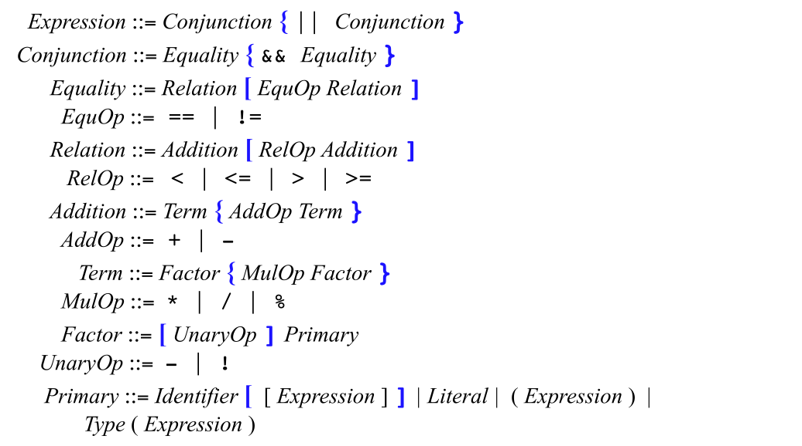

# Clite symbol table

**Subject: Implement a Symbol table (as described in the Lecture: SyntaxC.) You can choose any suitable data structure.**

> From lecture notes: A **symbol table** is a data structure kept by a translator that allows it to keep track of each declared name and its binding

In the following, I discuss the Clite language and 

## The *Clite* language

For the following exercices, we are going to reuse the simple *Clite* program defined in lecture notes by the following slides:





Here is the example Clite code that will be used for testing. It is a direct example with minor modifications (like nested blocks) from lecture notes:

`course_example.clite`

```c
int h, i;
void B(int w) {
    int j, k;
    i = 2*w;
    w = w + 1;
}

void A(int x, int y) {
    float i, j;
    B(h);
    i = 3;
    {
        int i, j;
        char m;
        i = 4;
        j = 5;
    }
}

void main() {
    int a, b;
    h = 5; a = 3; b = 2;
    A(a, b);
    B(h);
}
```


## static scoping

I have implementing a simple static scoping symbol table.  The code implements a static scoping symbol table for a programming language define in the lecture (Clite). 

An example of the results expected is given in lecture notes:


The code parses a source file line by line, identifying variable declarations and the start and end of scopes (i.e., blocks of code).

> The code has been tested on Fedora 34.

Here is the output for the following input *Clite* file:

Output of the static scoping symbol table for the `course_example.clite` input *Clite* file:

```shell
(phdtrack-311) [onyr@kenzael programing_paradigm]$ python src/clite_symbol_table/static_scoping/main.py 
Static symbol table generation...
Scope (void B(int w) ) variables: <j, int, 3>, <k, int, 3>
Scope (unnamed_scope_CIFan) variables: <i, int, 13>, <j, int, 13>, <m, char, 14>
Scope (void A(int x, int y) ) variables: <i, float, 9>, <j, float, 9>
Scope (void main() ) variables: <a, int, 21>, <b, int, 21>
Scope (global) variables: <h, int, 1>, <i, int, 1>
```
